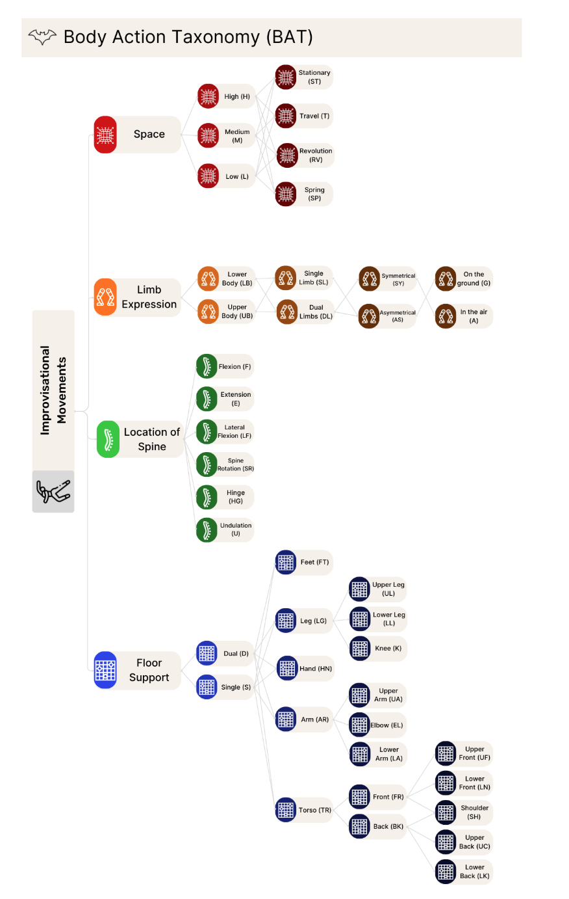
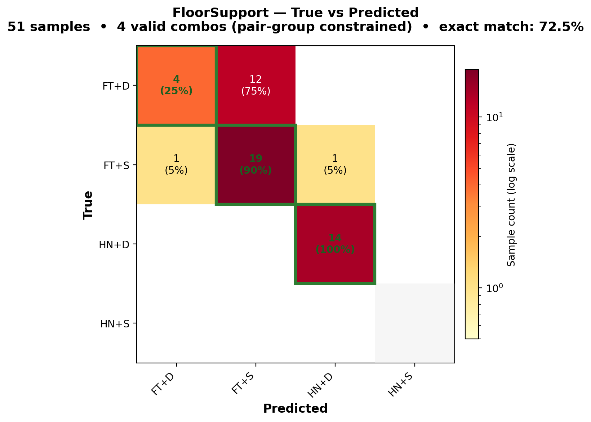
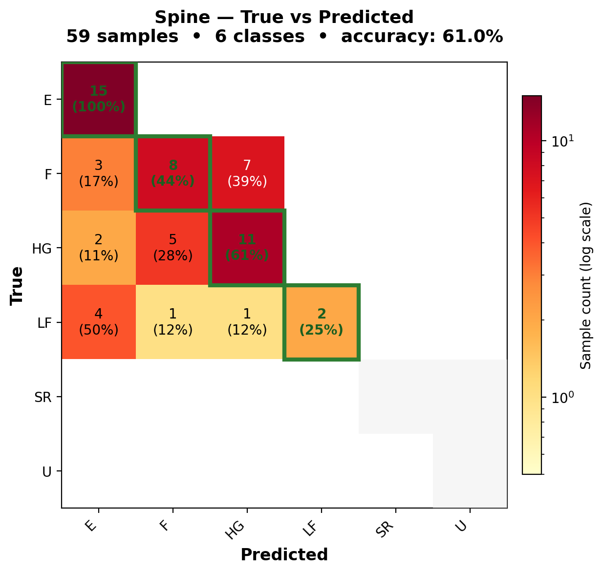
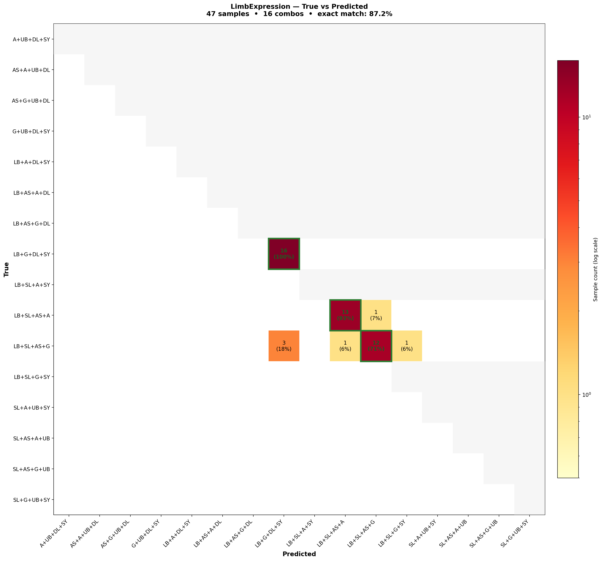
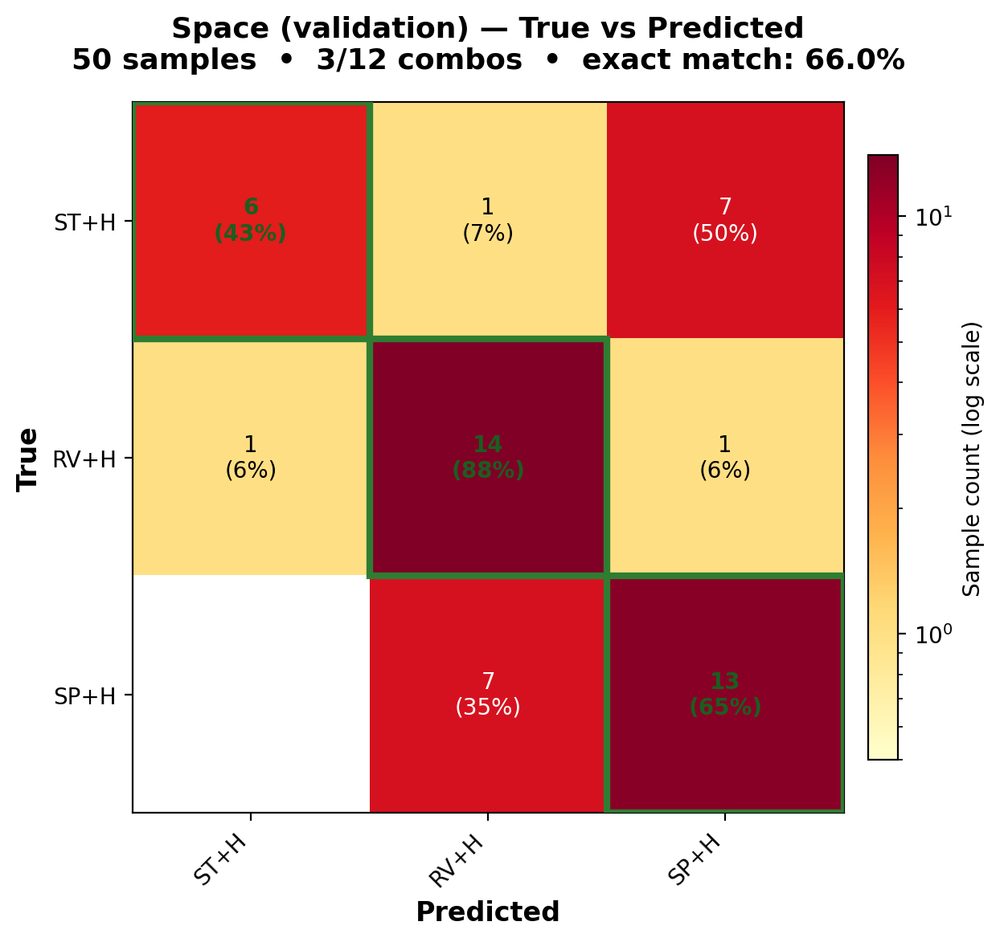
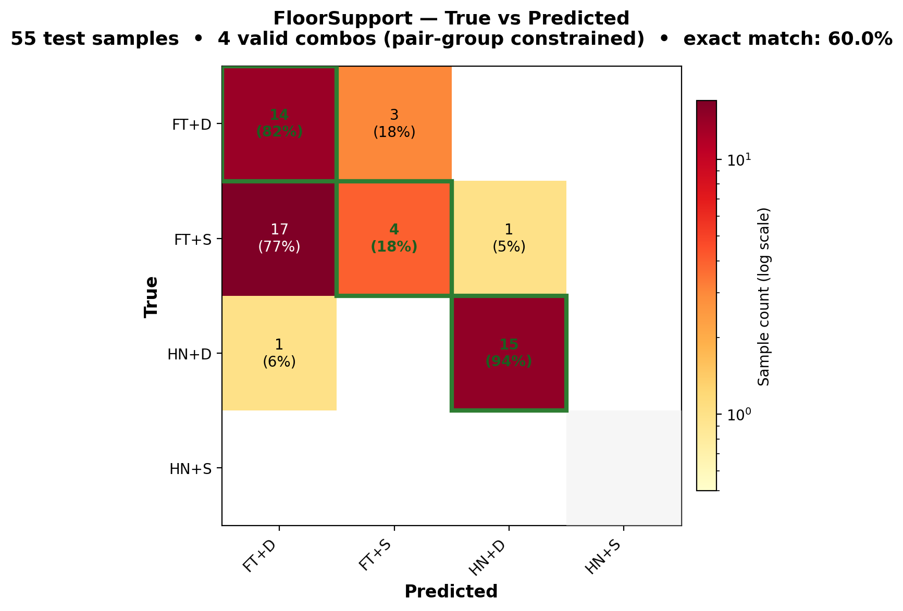
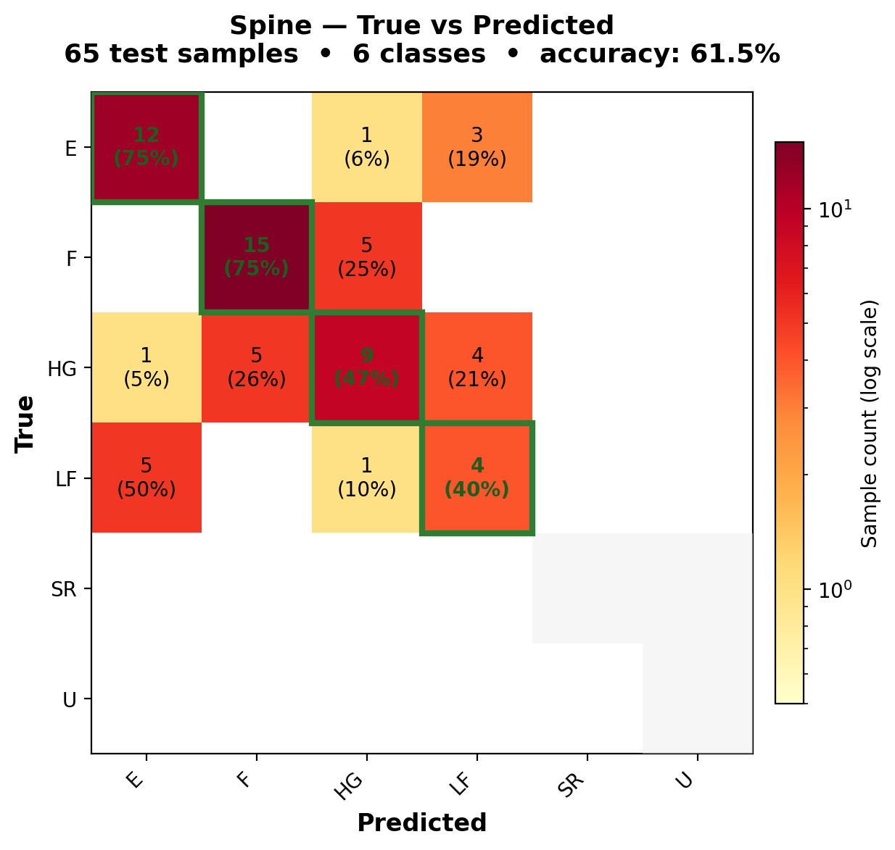
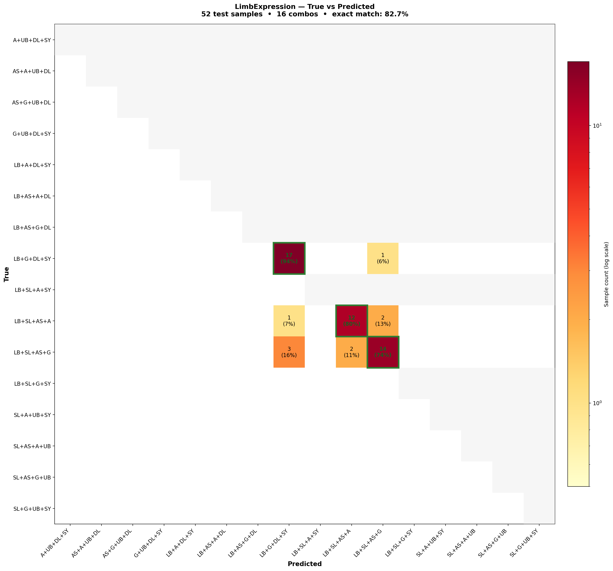
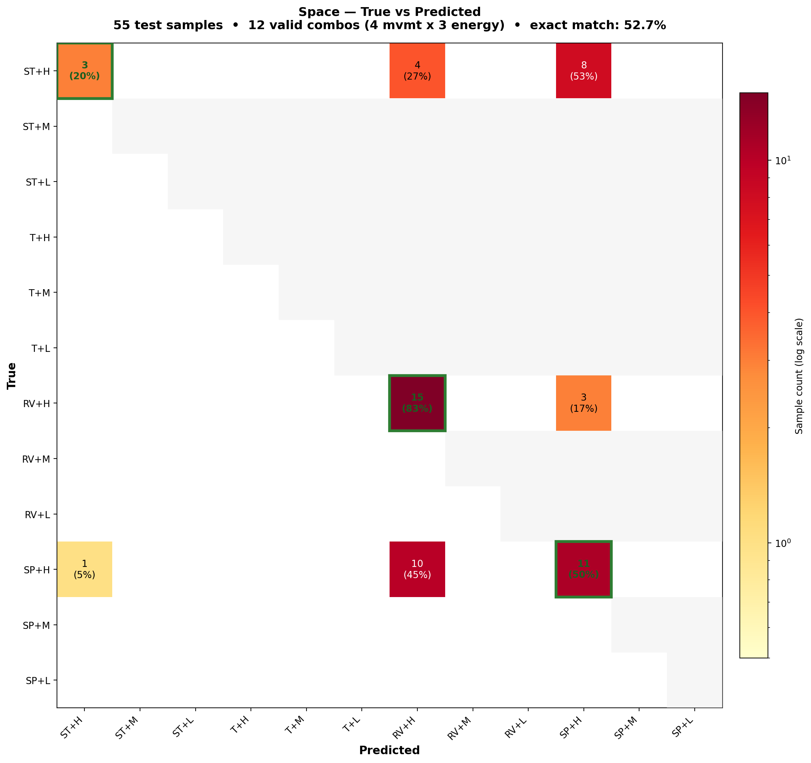

# LuminAIxBATModel

Classifies body movement into **BAT (Body Articulation Type)** codes across four regions: FloorSupport, Spine, LimbExpression, Space. All models use 73-dim plumbline features (COG-relative, scale-invariant) and output per-pair normalized probabilities. **0.5 threshold** for binary pairs, **argmax** for 3+ groups.

## Design

- **COG-relative features.** Plumbline distances/angles are invariant to body height and translation — no separate normalization needed.
- **Pair-group constraints.** Structurally enforced mutual exclusivity via per-group softmax + CrossEntropyLoss. No invalid combos possible.
- **D-weight penalty.** FloorSupport weights D (dual-foot) 1.5× in the S↔D loss to balance false negatives (FT+D 25%, FT+S 90% on val).
- **Reproducible.** All `main.py` scripts accept `--seed` (default 42), setting `random`/`numpy`/`torch` seeds.
- **Architecture tested per region.** BiLSTM+attention (FloorSupport), BiLSTM+mean pool+class weights (Spine, Space), CNN+contrastive heads (LimbExpression). Deeper classifiers and attention pooling overfit on small datasets (<300 samples).

## BAT Origins

Developed at the **Georgia Tech Expressive Machinery Lab** (LuminAI project). Grounded in **Laban Movement Analysis** (Body component). Key paper: Trajkova et al., *"Exploring Collaborative Movement Improvisation Towards the Design of LuminAI"*, CHI '24.

---

## FloorSupport — Foot/Hand Contact (4 codes, 2 binary pairs)

| Combo | Train | Val | Test | Val Acc | Test Acc |
|-------|------:|----:|-----:|--------:|---------:|
| FT+D | 77 | 16 | 17 | **25%** | **82%** |
| FT+S | 100 | 21 | 22 | **90%** | **18%** |
| HN+D | 69 | 14 | 16 | **100%** | **94%** |
| HN+S | 0 | 0 | 0 | — | — |

> D-weight 1.5× balances S↔D. HN+S has no data.

## Spine — Spine Movement (6-class single-label)

| Class | Train | Val | Test | Val Acc | Test Acc |
|-------|------:|----:|-----:|--------:|---------:|
| E (Extension) | 72 | 15 | 16 | **73%** | **75%** |
| F (Flexion) | 87 | 18 | 20 | **61%** | **75%** |
| HG (Hinge) | 84 | 18 | 19 | **83%** | **47%** |
| LF (Lat Flexion) | 40 | 8 | 10 | **50%** | **40%** |
| SR, U | 0 | 0 | 0 | — | — |

> Class weights (LF=1.8×, F=1.2×) + lr=5e-4. SR and U have no data. LF has only 40 samples.

## LimbExpression — Limb Patterns (8 codes, 4 binary pairs)

| Combo | Train | Val | Test | Val Acc | Test Acc |
|-------|------:|----:|-----:|--------:|---------:|
| LB+DL+SY+G | 79 | 16 | 18 | **100%** | **94%** |
| LB+SL+AS+A | 67 | 14 | 15 | **93%** | **80%** |
| LB+SL+AS+G | 81 | 17 | 19 | **71%** | **74%** |
| All UB combos (8) | 0 | 0 | 0 | — | — |
| Other 5 combos | 0 | 0 | 0 | — | — |

> Only 3/16 combos have data. All UpperBody combos missing.

## Space — Spatial/Energy (7 codes, 2 pair groups)

Movement `[ST, T, RV, SP]` × Energy `[H, M, L]` = 12 combos.

| Combo | Train | Val | Test | Val Acc | Test Acc |
|-------|------:|----:|-----:|--------:|---------:|
| H+RV | 77 | 16 | 18 | **88%** | **83%** |
| H+SP | 95 | 20 | 22 | **65%** | **50%** |
| H+ST | 65 | 14 | 15 | **43%** | **20%** |
| All M, L, T combos (9) | 0 | 0 | 0 | — | — |

> 9/12 combos missing. No Medium/Low energy, no Transition movement.

---

## Confusion Matrices (Validation)

## Confusion Matrices (Test)

---

## Future Work

- **Data augmentation:** time warping, left-right mirroring, Gaussian noise, frame dropout.
- **AI-generated data:** motion diffusion models conditioned on missing combos → human expert labels → training set.
- **More data needed:** HN+S (FloorSupport), SR/U (Spine), all UB combos (LimbExpression), M/L/T combos (Space).

---

## BAT Code Slogans

Codes marked `—` need a `batdesc_` GameObject in the Unity scene.

| Region | Code | Slogan |
|:---|:---|:---|
| Floor | D-FT | I think you're balancing on two feet. |
| Floor | S-FT | I think you're balancing on one foot, like a flamingo. |
| Floor | D-HN | I think you're balancing on two hands, like an acrobat. |
| Floor | S-HN | — |
| Spine | E | I think your spine is stretching back... |
| Spine | F | I think your spine is bending forward, almost like you're bowing. |
| Spine | HG | I think you're moving your spine like an inflatable tube man. |
| Spine | LF | I think your spine is bending side to side like a fitness instructor. |
| Spine | SR | I think your spine is twisting at your waist... |
| Spine | U | — |
| Limb | LB | — |
| Limb | SL | I believe you're using one limb. |
| Limb | AS | I think one or both limbs are moving differently from the other. |
| Limb | A | From what I can see, one or more limbs are moving in the air. |
| Limb | G | I think one or more limbs are moving, while still touching the ground. |
| Limb | UB | — |
| Limb | DL | I think you're using, let me think, two limbs. |
| Limb | SY | I think both limbs are mirroring each other. |
| Space | ST | I think you're stationary or moving in place! |
| Space | T | — |
| Space | RV | I think you're turning or spinning like a top! |
| Space | SP | I think you're jumping in the air! |
| Space | H | I think you're in high space... |
| Space | M | I think you're in medium space... |
| Space | L | — |
