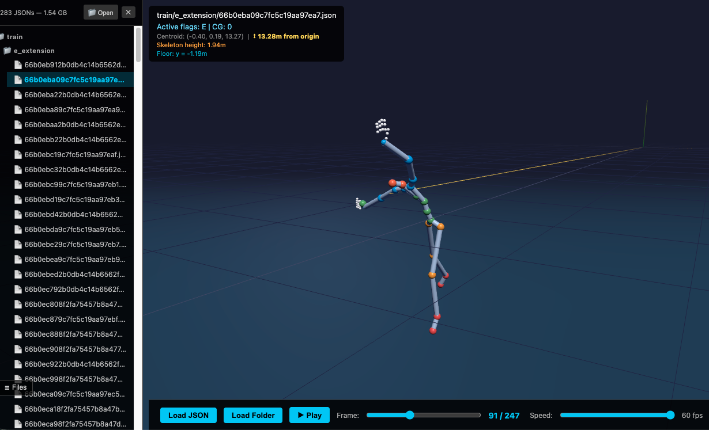

# LuminAIxBATModel


## BAT 🦇 Code Definitions

### Floor Support <sub>(Atlas color: BLUE)</sub>

The primary segment responsible for bearing weight — generally, what body part is touching the floor.

| Code | Name | Definition |
|:----:|:-----|:-----------|
| D | Dual | Utilizing symmetrical body parts such as two feet or two elbows for support |
| S | Single | Utilizing one body part for support such as one hand, knee, etc. |
| FT | Feet | Only the foot/feet are touching the ground |
| LG | Leg | The leg (non-foot) is supporting weight, such as shins on the ground |
| UL | Upper Leg | Above the knee to below the hip supports weight |
| LL | Lower Leg | Below the knee to above the foot supports weight |
| K | Knee | Knee supports weight |
| HN | Hand | Utilizing hand/hands to support or transfer weight, such as in a cartwheel |
| AR | Arm | Utilizing the arm (non-hand) to support weight, such as in a forearm handstand |
| UA | Upper Arm | The arm from above the elbow to below the shoulder supports weight |
| LA | Lower Arm | The arm from below the elbow to above the hand supports weight |
| EL | Elbow | The elbow supports weight |
| TR | Torso | The entire front and back of the trunk between the neck and above the upper legs — including shoulders, back, chest, stomach, pelvis, hips, and buttocks |
| FR | Front Torso | The front body of the entire torso/trunk |
| UF | Upper Front | Chest and ribcage support weight |
| LN | Lower Front | Lower stomach and front of pelvis support weight |
| SH | Front Shoulder | The front of the shoulders support weight |
| BK | Back Torso | The back body of the entire torso/trunk |
| UA | Upper Back | Cervical and thoracic spine |
| LK | Lower Back | Lumbar through tailbone/butt |
| SH | Back Shoulder | The back of the shoulders support weight |

### Location of Spine <sub>(Atlas color: GREEN)</sub>

Position and alignment of the spine (cervical to lumbar spine).

| Code | Name | Definition |
|:----:|:-----|:-----------|
| F | Flexion | Movement of the spine forward, as if curling into a ball — moving the body closer to the ground or towards a central point, contracting towards the center of space |
| E | Extension | Movement of the spine backward, as if arching the back — moving the body away from the ground or towards the periphery of space, expanding outward |
| LF | Lateral Flexion | Bending of the spine to one side, as if reaching for something on the ground or the sky — moving the body laterally in space |
| SR | Spine Rotation | Twisting of the spine to either side, as if looking over one shoulder — changing the orientation of the body relative to the environment |
| HG | Hinge | Creasing forward at the hip while maintaining a neutral spine |
| U | Undulation | Multiple spine actions occurring in a continuous, sequential motion |

### Limb Expression <sub>(Atlas color: ORANGE)</sub>

Intentional movement created by upper and lower limb(s).

| Code | Name | Definition |
|:----:|:-----|:-----------|
| LB | Lower Body | Utilizes body parts below the hip |
| UB | Upper Body | Utilizes body parts above the hip |
| DL | Dual Limbs | Utilizes both limbs |
| SL | Single Limb | Intentionally utilizes only one limb while the other limb is in a passive position |
| SY | Symmetrical | One limb is intentionally doing exactly what the other limb is doing |
| AS | Asymmetrical | Two corresponding limbs are intentionally doing the opposite of one another |
| A | Active Limb (in the air) | Any intentional limb motion not touching the ground — e.g. port de bras, leg extensions |
| G | Active Limb (on the ground) | Any intentional limb motion touching the ground — e.g. rond de jambe of arm or leg |

### Space <sub>(Atlas color: RED)</sub>

Vertical levels and movement through space.

| Code | Name | Definition |
|:----:|:-----|:-----------|
| H | High | The highest level of space — feet, heels, and toes distinctly off the floor, e.g. relevés (demi-pointe), jumps, leaps |
| M | Medium | The medium level of space — standing zone or standard anatomical positioning (vertically stacked) with feet flat on the floor |
| L | Low | The lowest level of space — shoulders equal to or below standing hip height, or any time knees touch the floor; e.g. any floor movement |
| ST | Stationary | Includes weight shifts before change of support |
| T | Travel | Horizontal shift in space — moves beyond change of support |
| RV | Revolution (Turning) | Rotation equal to or more than 180 degrees |
| SP | Spring | Upward level change causing both feet to leave the floor |

---

Classifies body movement into **BAT (Body Articulation Type)** codes across four regions: FloorSupport, Spine, LimbExpression, Space. All models use 73-dim plumbline features (COG-relative, scale-invariant) and output per-pair normalized probabilities. **0.5 threshold** for binary pairs, **argmax** for 3+ groups.

> **Two accuracy metrics:** The table below reports **per-bit accuracy** (each code checked independently — partial credit). The confusion heatmaps show **exact match** (all codes must be correct for a sample to count). Per-bit is always higher. For example, if only the D bit is wrong on an FT+D sample, it scores 3/4 = 75% per-bit but 0% exact match.

## Design

- **COG-relative features.** Plumbline distances/angles are invariant to body height and translation — no separate normalization needed.
- **Pair-group constraints.** Structurally enforced mutual exclusivity via per-group softmax + CrossEntropyLoss. No invalid combos possible.
- **Multi-head decoding.** Each mutually exclusive code group gets its own attention + classifier head on a shared backbone. The heads decide independently, so the frames that matter for one decision (e.g. the brief moment of dual-foot contact) don't have to compete with the frames that matter for another (foot vs hand). This also allows zero-shot compositional predictions — e.g. HN+S (single hand) is a reachable output even with no HN+S training data.
- **Attention pooling everywhere.** Attention beats mean pooling in every region — brief events (jumps, dual-foot contact) get washed out by averaging over 256 frames. Deep classifiers overfit on small datasets (<300 samples); shallow heads with LayerNorm work best.
- **Reproducible.** All `main.py` scripts accept `--seed` (default 42), setting `random`/`numpy`/`torch` seeds.

### Model Structures

| Region | Backbone | Pooling | Heads | Loss / Weights |
|:-------|:---------|:--------|:------|:---------------|
| **FloorSupport** | BiLSTM (73→256×2, 2 layers) | Per-head attention | **2 heads**: FT↔HN, S↔D (each: attn → Linear→LayerNorm→ReLU→Dropout→2) | CE per group; D weighted 2.0× (FT+D: 25%→69% val, 29%→82% test) |
| **Spine** | BiLSTM (73→256×2, 2 layers) | Single attention | **1 head**: 6-way softmax E/F/HG/LF/SR/U (single-label — one class per sample, nothing to split) | CE; class weights LF=3.0×, F=1.2× |
| **LimbExpression** | 1D CNN (73→128→256→512) | AdaptiveAvgPool | **4 heads**: LB↔UB, SL↔DL, AS↔SY, A↔G (each: Linear→ReLU→Dropout→1 sigmoid) | BCE per head |
| **Space** | BiLSTM (73→256×2, 2 layers) | Per-head attention | **2 heads**: movement ST/T/RV/SP (4-way), energy H/M/L (3-way) | CE per group; ST weighted 1.8× (ST+H: 43%→71% val, 20%→73% test) |

## BAT Origins

Developed at the **Georgia Tech Expressive Machinery Lab** (LuminAI project). Grounded in **Laban Movement Analysis** (Body component). Key paper: Trajkova et al., *"Exploring Collaborative Movement Improvisation Towards the Design of LuminAI"*, CHI '24.

---

## FloorSupport — Foot/Hand Contact (4 codes, 2 binary pairs)

| Combo | Train | Val | Test | Val Acc | Test Acc |
|-------|------:|----:|-----:|--------:|---------:|
| FT+D | 77 | 16 | 17 | **69%** | **82%** |
| FT+S | 100 | 21 | 22 | **57%** | **64%** |
| HN+D | 69 | 14 | 16 | **100%** | **94%** |
| HN+S | 0 | 0 | 0 | — | — |

> Two-head attention + D-weight 2.0× balances S↔D. HN+S has no data.

## Spine — Spine Movement (6-class single-label)

| Class | Train | Val | Test | Val Acc | Test Acc |
|-------|------:|----:|-----:|--------:|---------:|
| E (Extension) | 72 | 15 | 16 | **87%** | **88%** |
| F (Flexion) | 87 | 18 | 20 | **78%** | **95%** |
| HG (Hinge) | 84 | 18 | 19 | **72%** | **47%** |
| LF (Lat Flexion) | 40 | 8 | 10 | **38%** | **50%** |
| SR (Spine Rotation) 🆕 | 51 | 11 | 12 | **100%** | **100%** |
| U (Undulation) 🆕 | 60 | 12 | 14 | **100%** | **93%** |

> All 6 classes now have data (SR/U added from spine_downloaded). Attention pooling + class weights (LF=3.0×, F=1.2×) + lr=5e-4, 80 epochs. Re-trained 2026-07-13: overall val acc 78.1% → 80.5% (test 79.1%). LF still weakest (40 samples) — F↔HG confusion and suspected wrong labels remain the main barriers.

## LimbExpression — Limb Patterns (8 codes, 4 binary pairs)

| Combo | Train | Val | Test | Val Acc | Test Acc |
|-------|------:|----:|-----:|--------:|---------:|
| LB+G+DL+SY | 61 | 9 | 13 | **100%** | **96%** |
| UB+G+DL+SY 🆕 | 41 | 11 | 11 | **96%** | **96%** |
| LB+SL+AS+A | 67 | 14 | 15 | **100%** | **95%** |
| LB+SL+AS+G | 81 | 17 | 19 | **93%** | **88%** |
| UB+DL+AS+A 🆕 | 58 | 12 | 13 | **100%** | **94%** |
| UB+DL+AS+G 🆕 | 35 | 7 | 9 | **93%** | **97%** |
| UB+DL+SY+A 🆕 | 58 | 12 | 13 | **98%** | **98%** |
| UB+SL+AS+A 🆕 | 58 | 12 | 14 | **100%** | **100%** |
| UB+SL+AS+G 🆕 | 32 | 6 | 8 | **79%** | **84%** |
| Other 7 combos | 0 | 0 | 0 | — | — |

> 🆕 = data added 2026-07-13. Re-trained on the expanded 9-combo dataset (491 train gestures, up from 227): best per-bit val acc **96.2%**. Five brand-new UpperBody combos were split in, and UB+G+DL+SY grew from 30 to 63 recordings. UB+SL+AS+G is the weakest (only 46 recordings). 9/16 combos now have data.

## Space — Spatial/Energy (7 codes, 2 pair groups)

Movement `[ST, T, RV, SP]` × Energy `[H, M, L]` = 12 combos.

| Combo | Train | Val | Test | Val Acc | Test Acc |
|-------|------:|----:|-----:|--------:|---------:|
| RV+H | 77 | 16 | 18 | **96%** | **97%** |
| RV+M 🆕 | 58 | 12 | 14 | **98%** | **94%** |
| SP+H | 95 | 20 | 22 | **96%** | **95%** |
| ST+H | 65 | 14 | 15 | **98%** | **92%** |
| ST+M 🆕 | 72 | 15 | 16 | **98%** | **95%** |
| All L, T combos + SP+M (7) | 0 | 0 | 0 | — | — |

> First Medium-energy data added (M-ST, M-RV) — the 3-way energy head is finally trainable. Two-head attention (movement/energy) + M-weight 1.5× (H=237 vs M=130 train samples). Re-trained 2026-07-13: best per-bit val acc 97.0%. Remaining gaps: Low energy, Transition movement, SP+M.

---

## Confusion Matrices

| Region | Validation | Test |
|:-------|:----------:|:----:|
| **FloorSupport** |  |  |
| **Spine** |  |  |
| **LimbExpression** |  |  |
| **Space** |  |  |

---

## Tools

### Skeleton Viewer (`skeleton_viewer.html`)

A self-contained 3D motion viewer — just **open the file in a browser** (double-click; no server needed, but internet is required on first load for the Three.js CDN).

**Loading recordings:**
- **Load JSON** button — pick a single motion `.json` file
- **Drag & drop** a `.json` anywhere onto the window
- **Load Folder / 📁 Open** — load a whole directory recursively; files appear in a sidebar tree (toggle with **☰ Files**), first file auto-loads

**Controls:**

| Action | Control |
|:---|:---|
| Play / pause | `Space` or ▶ button |
| Playback speed | slider — 10 / 30 / 60 fps |
| Scrub frames | Frame slider, or `←` / `→` for single steps |
| Prev / next file in folder | `↑` / `↓` (or PageUp / PageDown) |
| Rotate / zoom / pan camera | drag / scroll / right-drag |
| Recenter on skeleton | `F` or `R` |

Displays a color-coded skeleton (green = spine, blue = arms, orange = legs, red = feet), a floor grid, an estimated floor plane at the lowest foot position, and an info panel showing the file's BAT flags, centroid, and skeleton height.

### Evaluation Scripts

**`evaluate_per_code.py`** — per-code recall, confusion matrices, and error breakdowns for all regions:

```bash
python evaluate_per_code.py [--region FloorSupport Spine LimbExpression Space] [--device cpu|cuda] [--plot]
```

| Argument | Default | Description |
|:---|:---|:---|
| `--region` | `all` | Which region(s) to evaluate — any subset of `FloorSupport`, `Spine`, `LimbExpression`, `Space` |
| `--device` | `cpu` | Torch device for inference |
| `--plot` | off | Also save visualization dashboards (PNG, 150 dpi) |

**`heatmap_all_models.py`** — regenerates all 8 confusion heatmaps shown above (no arguments):

```bash
python heatmap_all_models.py
```

Runs all four regions on both the **val** and **test** splits, finds each region's best checkpoint automatically, and writes `heatmap_<region>.png` (val) and `heatmap_<region>_test.png` (test) to `assets/` at 200 dpi. Regions with a missing checkpoint or dataset are skipped with a warning.

---

## Data Loss Notes

The `limb_expression_downloaded` folder was replaced with a fresh download on **2026-07-13**. Two things were lost in the swap:

1. **Original mocap recordings for LB+SL+AS+A and LB+SL+AS+G survive only in `limb_expression_raw`.** The old download contained 96 (LB+SL+AS+A) and 117 (LB+SL+AS+G) original `bodyFrames` recordings; the new download covers only 61 and 76 of them, and only in pre-computed feature form. The full original-format sets now exist **only** as the copies in `limb_expression_raw/` — do not delete or regenerate that folder from scratch, or 35 + 41 recordings are gone for good.
2. **No original mocap data for the new UpperBody classes.** The newly added UB classes (UB-DL-AS-A, UB-DL-AS-G, UB-DL-SY-A, UB-SL-AS-A, UB-SL-AS-G, and the UB-DL-SY-G top-up) came with pre-computed 73-dim feature files (`results_json/`) only — no `bodyFrames` recordings. They train fine (the loader supports both formats), but they can't be displayed in the skeleton viewer and their features can't be recomputed if the feature pipeline ever changes.

## Daily Updates

| Date | Update |
|:-----|:-------|
| 2026-07-14 | Updated all accuracy tables and confusion heatmaps with the re-trained models. The pre-update benchmark README is archived on branch `benchmark-without-complete-data`. |
| 2026-07-13 | Received the new LimbExpression data (5 new UB classes + 33 new UB-DL-SY-G recordings), split it into `limb_expression_raw` train/val/test (70/15/15, seed 42), and re-trained LimbExpression (96.2% per-bit val), Space (97.0%), and Spine (80.5% val). |

---

## Current Barriers

1. **Wrong data labels.** Some recordings are labeled incorrectly — e.g. the sample below is labeled Extension (E) but is actually forward-leaning (F) from frame ~90 onward. Label noise like this caps the achievable accuracy no matter the architecture: the model gets penalized for predicting the *true* movement.

   

2. **Open question — label semantics.** Does one label mean the movement is that code *most* of the time, or *all* of the time? A recording that starts neutral and bends forward at frame 90 is ambiguous under "most of the time" semantics. This needs a labeling convention decision before re-annotation.

## Future Work

- **Cross-label existing recordings.** Every recording already contains movement in all four regions — a session recorded for FloorSupport can also be labeled for Spine, LimbExpression, and Space. This could fill missing categories (SR/U, UB combos, M/L/T) without new capture sessions.
- **Data augmentation:** time warping, left-right mirroring, Gaussian noise, frame dropout. *(Tested on Spine: temporal jitter + noise + frame dropout gave 71.2% vs 74.6% baseline — augmentation can't fix label noise; clean labels first.)*
- **AI-generated data:** motion diffusion models conditioned on missing combos → human expert labels → training set.
- **More data needed:** HN+S (FloorSupport), more LF (Spine), the 7 remaining combos (LimbExpression), L/T combos + SP+M (Space).

---

## BAT Code Slogans

Codes marked `—` need a `batdesc_` GameObject in the Unity scene.

| Region | Code | Slogan |
|:---|:---|:---|
| Floor | D-FT | I think you're balancing on two feet. |
| Floor | S-FT | I think you're balancing on one foot, like a flamingo. |
| Floor | D-HN | I think you're balancing on two hands, like an acrobat. |
| Floor | S-HN | — |
| Spine | E | I think your spine is stretching back... |
| Spine | F | I think your spine is bending forward, almost like you're bowing. |
| Spine | HG | I think you're moving your spine like an inflatable tube man. |
| Spine | LF | I think your spine is bending side to side like a fitness instructor. |
| Spine | SR | I think your spine is twisting at your waist... |
| Spine | U | — |
| Limb | LB | — |
| Limb | SL | I believe you're using one limb. |
| Limb | AS | I think one or both limbs are moving differently from the other. |
| Limb | A | From what I can see, one or more limbs are moving in the air. |
| Limb | G | I think one or more limbs are moving, while still touching the ground. |
| Limb | UB | — |
| Limb | DL | I think you're using, let me think, two limbs. |
| Limb | SY | I think both limbs are mirroring each other. |
| Space | ST | I think you're stationary or moving in place! |
| Space | T | — |
| Space | RV | I think you're turning or spinning like a top! |
| Space | SP | I think you're jumping in the air! |
| Space | H | I think you're in high space... |
| Space | M | I think you're in medium space... |
| Space | L | — |
